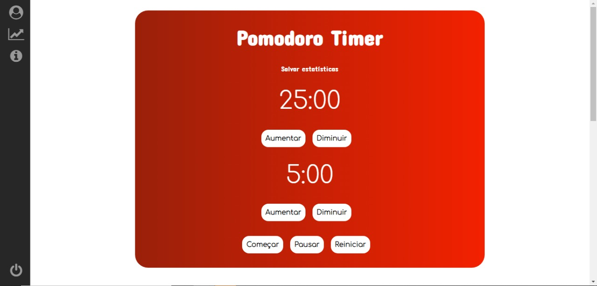
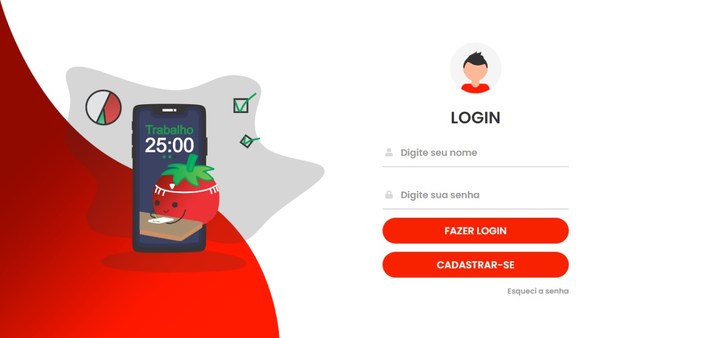

# Pomodoro Timer
 Preview da home:
 
 # Página de login
  

- [ X ] O usuário pode ver um temporizador por 25 minutos - a sessão de trabalho.

- [ X ] Após o término da sessão de trabalho, o Usuário pode ver um temporizador por 5 minutos - a sessão de intervalo.

- [ X ] O usuário poderá usar a ferramenta tanto no celular através de um aplicativo quanto no navegador do computador.

- [  ] O usuário pode ouvir um som tocando quando o temporizador acabar - denotando que a sessão terminou (00:00).

- [ X ] O usuário pode alterar / personalizar os minutos em ambas as sessões antes de iniciar.
- [ X ] O usuário pode definir uma longa sessão de pausa de 10 minutos. Isso será ativado a cada 4ª sessão de intervalo.

- [ ] Por último, (Tendo o restante funcionando) o usuário poderá fazer login para armazenar suas estatísticas de uso do pomodoro.
